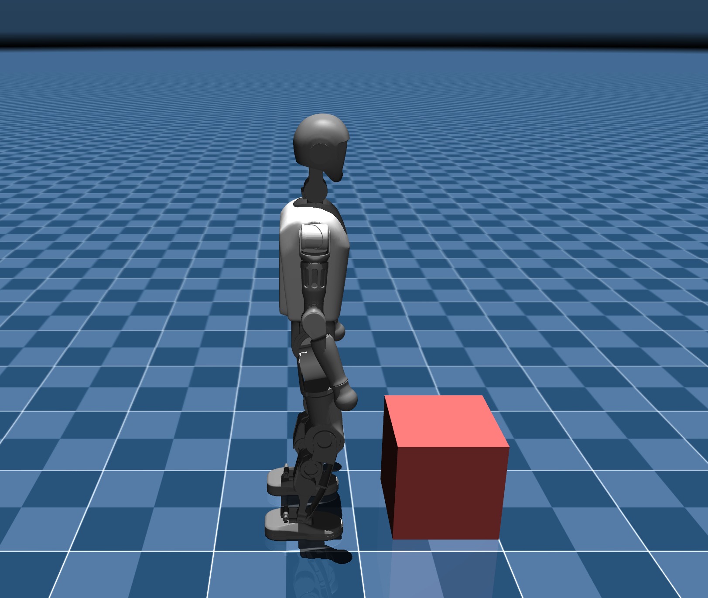

# humanoid_graduate_research

This research focuses on developing control strategies that enable humanoid robots to maintain balance and stability while carrying objects. 

## Credits

This project uses the T1 humanoid MuJoCo model adapted from the  
[Booster Robotics booster_gym repository](https://github.com/BoosterRobotics/booster_gym).

Copyright © 2024 **Booster Robotics Technology Co., Ltd.**

Licensed under the **Apache License, Version 2.0**.

